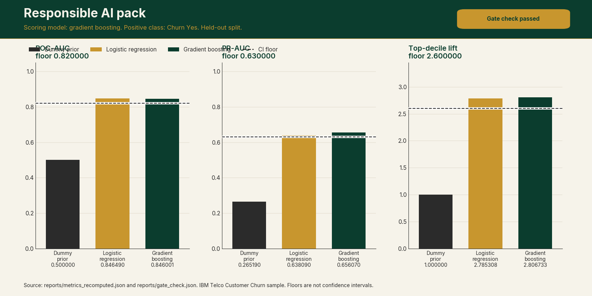
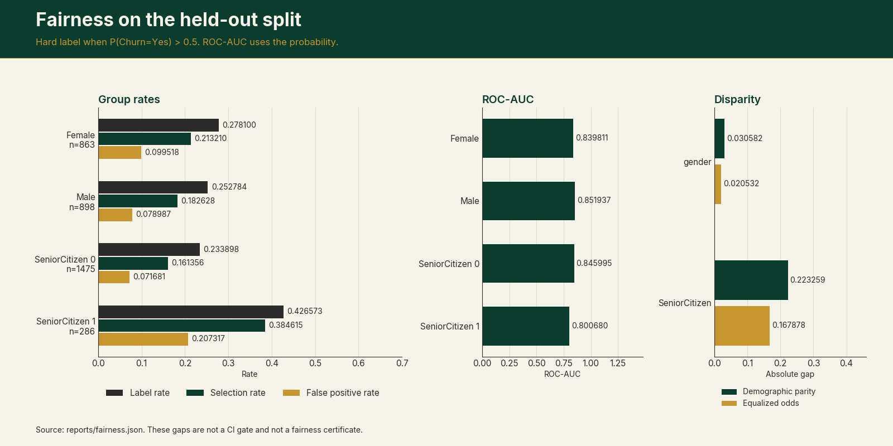
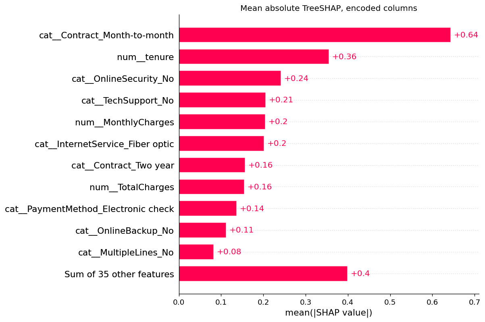
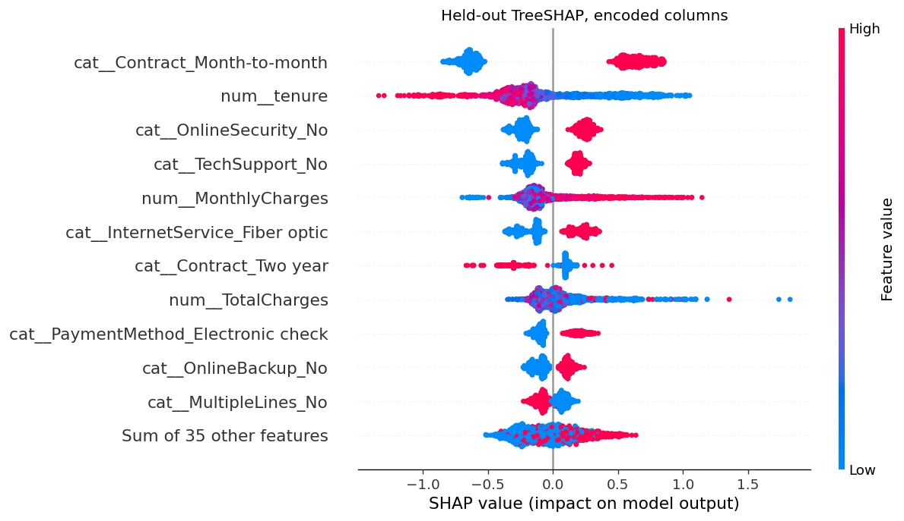
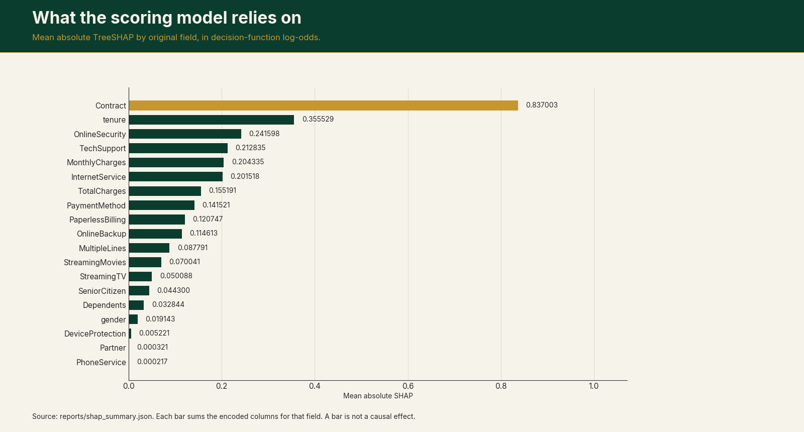
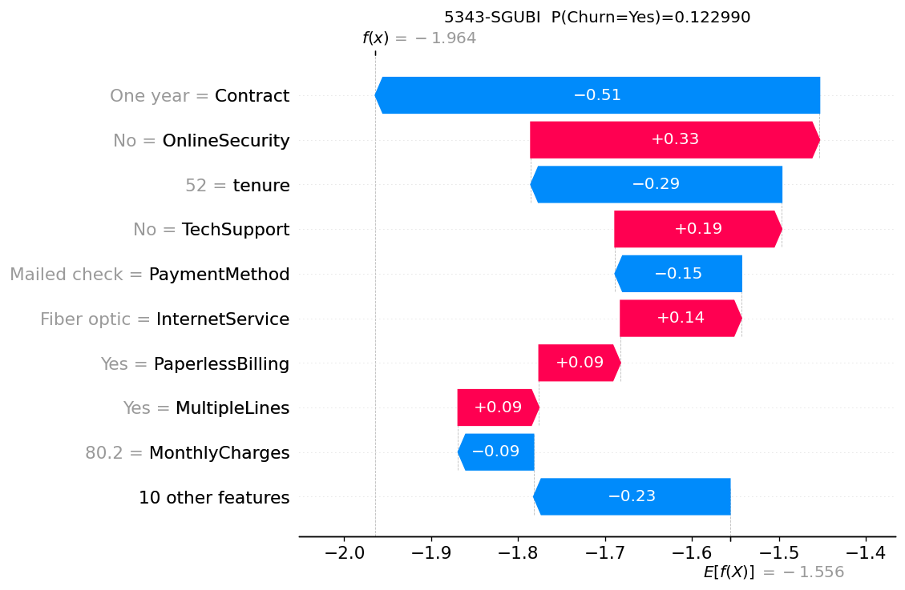
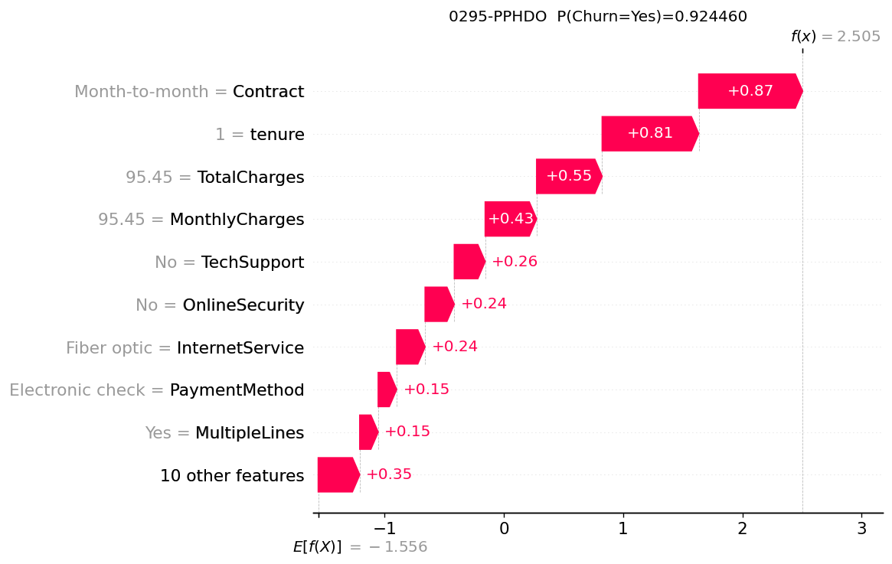
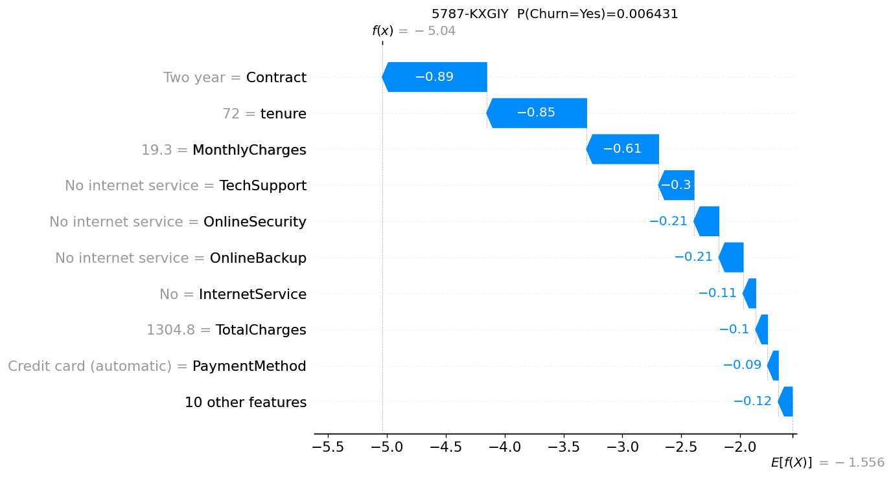
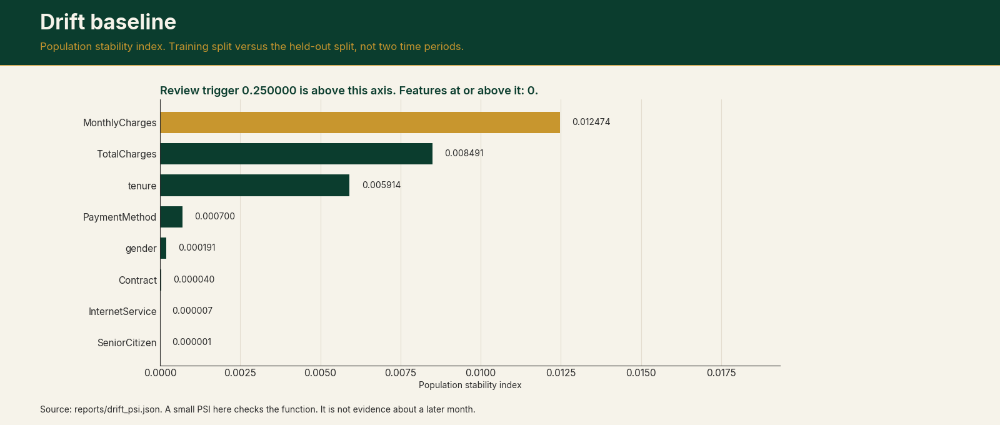

# Responsible AI pack



*Held-out metrics for the dummy prior, logistic regression, and the scoring gradient boosting model. Floors are the CI gates. Rendered from `reports/metrics_recomputed.json` and `reports/gate_check.json` with `scripts/render_readme_assets.py`.*

[](https://github.com/ChristopherKiokoStrathmore/responsible-ai-pack/actions/workflows/ci.yml)
[](https://www.python.org/downloads/)
[](LICENSE)

A churn model is only useful if people can trust it. What does it rely on, is it fair across customer groups, and what happens when it degrades?

This repo adds governance to the churn model from [telco-churn-nba-engine](https://github.com/ChristopherKiokoStrathmore/telco-churn-nba-engine) (pinned commit): TreeSHAP explanations, Fairlearn fairness checks, PSI drift baseline, model cards, a NIST AI RMF checklist, monitoring plan, incident runbook and CI metric gates. Part of an independent portfolio series on telecom customer analytics, built alongside my MSc in Data Science. Structured using CRISP-DM.

## Findings at a glance

From `reports/fairness.json` on the held-out split:

- Demographic parity difference is 0.030582 for gender and 0.223259 for SeniorCitizen.
- The false positive rate is 0.207317 for SeniorCitizen 1 and 0.071681 for SeniorCitizen 0.
- ROC-AUC is 0.800680 for SeniorCitizen 1 and 0.845995 for SeniorCitizen 0.

## Key results

- Held-out metrics recomputed and matched upstream at six decimals: ROC-AUC 0.846001, PR-AUC 0.656070, top-decile lift 2.806733.
- CI gates: fails the build below ROC-AUC 0.82, PR-AUC 0.63 or lift 2.60. Current run passes.
- Fairness (demographic parity difference): gender 0.030582, SeniorCitizen 0.223259, flagged for review.

## Business Understanding

The score is useful only if a reviewer can see what the model relies on, how it treats the groups the table can measure, and what to do when a gated metric drops. The churn model is trained and saved elsewhere. This repo starts after that save.

| File | What it is |
| --- | --- |
| `MODEL_CARD.md` | Hugging Face-style card for the pinned churn model: intended use, out-of-scope use, data, metrics, limitations, human review. |
| `MODEL_CARD_MULTIHEAD.md` | Card for [MULTI-HEAD-](https://github.com/ChristopherKiokoStrathmore/MULTI-HEAD-) at `809bccd61077898849c428f37521fa198f7c7bf6`. Unstated facts stay "not documented in source repo". |
| `reports/metrics_recomputed.json` | Held-out ROC-AUC, PR-AUC, and top-decile lift for the saved dummy, logistic regression, and gradient boosting models. |
| `reports/shap/` | Global summary and bar plots, plus one local plot each for three held-out customers. Numbers are in `reports/shap_summary.json`. |
| `reports/fairness.json` | Fairlearn selection rate, true positive rate, false positive rate, and ROC-AUC by gender and SeniorCitizen, plus demographic parity and equalized odds differences. |
| `reports/drift_psi.json` | PSI between the training split and the held-out split. |
| `gates.yaml` | Floors under the scoring model's three held-out metrics. |
| `reports/gate_check.json` | Last recompute against those floors. |
| `GOVERNANCE_CHECKLIST.md` | One page mapped to NIST AI RMF Govern, Map, Measure, and Manage. |
| `MONITORING.md` | What to recompute on a later batch. |
| `INCIDENT_RUNBOOK.md` | What to do when a gated metric is below its floor. |
| `upstream.lock.json` | Commit SHAs and file SHA-256s for both source repos. |

## Data Understanding

Repository: [telco-churn-nba-engine](https://github.com/ChristopherKiokoStrathmore/telco-churn-nba-engine), commit `21f6115931f4358ebc7cc87d9ba1f4d87fd015aa`.

The pinned telco-churn-nba-engine commit (21f6115) is deliberate: later commits there changed docs only, not the model.

That repo has no `pyproject.toml` or `setup.py`, so this pack does not install it as a git dependency. `scripts/fetch_upstream.py` downloads the archive at that commit and checks the SHA-256 of each file in the lock, including `artifacts/churn_model.joblib`, `artifacts/scoring_bundle.joblib`, the CSV, and `reports/metrics.json`.

The upstream file records 7043 rows, 1869 with Churn Yes, rate 0.265370, and CSV SHA-256 `16320c9c1ec72448db59aa0a26a0b95401046bef5d02fd3aeb906448e3055e91`. It records the IBM repository license as Apache-2.0 for the code pattern, and says that repository does not state a separate license for the CSV.

`gender` and `SeniorCitizen` are columns in that table and inputs to the model. The CSV has no race, ethnicity, region, language, or disability column.

## Data Preparation

The split is the upstream function `telco_nba.pipeline.split_customers`: seed 42, test size 0.250000, stratified on `Churn`. Recomputed counts are 5282 train rows and 1761 test rows. The first held-out row with numeric `TotalCharges` is `5343-SGUBI`, the example id stored in the upstream metrics file.

This pack does not retrain and does not refit that split. Blank `TotalCharges` cells stay missing values. Median imputation sits inside the saved pipeline.

## Modeling

Not in scope. This repo reuses the pinned gradient-boosting churn model and does not train a replacement. A logistic regression and a dummy prior are stored in the same upstream bundle as comparison models. They are not the scoring artifact. The upstream file sets `scoring_model` to `gradient_boosting`.

### Multi-head card

The multi-head card is the same idea for a model this repo cannot load. The card records the gap instead of filling it.

`MODEL_CARD_MULTIHEAD.md` is limited to commit `809bccd61077898849c428f37521fa198f7c7bf6`.

Documented there, with links: a three-head demo (issue, sentiment, urgency), issue abstain threshold 0.6, smoke floors `minEmergencyRecall` 0.01 and `maxFalseEmergencyRate` 0.99, and the eval README's warning that those floors are not model quality.

Not documented in source repo: weights, architecture, training data, and any gold accuracy, F1, emergency recall, or false-emergency rate. This pack does not invent them and does not call the live API to manufacture a number.

## Evaluation

The figures in this phase are copied from `reports/` or from a file fetched at a pinned commit. `tests/test_docs.py` checks that.

### Held-out metrics

Scoring model: gradient boosting. Positive class: Churn Yes. Metrics use `telco_nba.metrics.classification_metrics` on the saved pipelines. `matches_upstream_metrics_at_six_decimals` is true, against [upstream `reports/metrics.json`](https://github.com/ChristopherKiokoStrathmore/telco-churn-nba-engine/blob/21f6115931f4358ebc7cc87d9ba1f4d87fd015aa/reports/metrics.json).

Top-decile lift follows that file: k = floor(n_test / 10), with tied scores shared across the cut. k is 176. The test base rate is 0.265190.

| Model | ROC-AUC | PR-AUC | Top-decile lift |
| --- | ---: | ---: | ---: |
| Dummy prior | 0.500000 | 0.265190 | 1.000000 |
| Logistic regression | 0.846490 | 0.638090 | 2.785308 |
| Gradient boosting | 0.846001 | 0.656070 | 2.806733 |

Logistic regression is higher on ROC-AUC. Gradient boosting is higher on PR-AUC and on top-decile lift. The scoring file stays gradient boosting, which is the upstream `scoring_model`.

### Fairness

`reports/fairness.json` is a Fairlearn `MetricFrame` on the held-out rows. Hard labels are the saved pipeline's `predict()`: positive when P(Churn=Yes) > 0.5. ROC-AUC uses the probability. Demographic parity difference is the absolute gap between the largest and smallest group selection rates. Equalized odds difference is the larger of the true-positive-rate gap and the false-positive-rate gap.

Both fields are inputs to the model. The CSV has no race, ethnicity, region, language, or disability column.

Overall, 467 of 1761 held-out rows are positive (rate 0.265190). The selection rate at this cutoff is 0.197615.

| Group | n | Label rate | Selection rate | TPR | FPR | ROC-AUC |
| --- | ---: | ---: | ---: | ---: | ---: | ---: |
| Female | 863 | 0.278100 | 0.213210 | 0.508333 | 0.099518 | 0.839811 |
| Male | 898 | 0.252784 | 0.182628 | 0.488987 | 0.078987 | 0.851937 |
| SeniorCitizen 0 | 1475 | 0.233898 | 0.161356 | 0.455072 | 0.071681 | 0.845995 |
| SeniorCitizen 1 | 286 | 0.426573 | 0.384615 | 0.622951 | 0.207317 | 0.800680 |



*Label rate, selection rate, false positive rate, and ROC-AUC by gender and SeniorCitizen, plus demographic parity and equalized odds differences. Rendered from `reports/fairness.json` with `scripts/render_readme_assets.py`.*

Gender: demographic parity difference 0.030582, equalized odds difference 0.020532. The two groups are close on every rate in the table. Mean absolute SHAP for gender is 0.019143.

SeniorCitizen: demographic parity difference 0.223259, equalized odds difference 0.167878. Value 1 is a smaller group and a higher churn rate (0.426573 against 0.233898). The selection-rate gap lines up with that base rate, and it is not only a base-rate gap: the false-positive rate is 0.207317 against 0.071681, and ROC-AUC is 0.800680 against 0.845995.

These are measurements on one split and one cutoff. They are not a CI gate and not a fairness certificate. A disparity budget needs an owner this pack does not have.

### SHAP

TreeSHAP (`shap.TreeExplainer` 0.47.2) on the gradient-boosting classifier, in decision-function log-odds. On all 1761 held-out rows the values plus the base value -1.556380 rebuild `decision_function` with max absolute error 0.000000.

Global plots are in the encoded column space the booster sees. The bar ranks mean absolute SHAP. The largest encoded column is `cat__Contract_Month-to-month` at 0.643924, then `num__tenure` at 0.355529, then `cat__OnlineSecurity_No` at 0.241598.





Summed to original fields, mean absolute SHAP is Contract 0.837003, tenure 0.355529, OnlineSecurity 0.241598, TechSupport 0.212835, and MonthlyCharges 0.204335. That sum is the sum of the encoded columns' mean absolute values, not the mean absolute of a sum.



*Mean absolute SHAP summed to original fields on the held-out rows. Rendered from `reports/shap_summary.json` with `scripts/render_readme_assets.py`.*

Local plots add the signed values back into the original field and label the bar with the raw value. They are explanations of this model, not causes.

| Customer | Why this row | Historical Churn | P(Churn=Yes) | Largest original field |
| --- | --- | --- | --- | --- |
| 5343-SGUBI | first held-out row with numeric TotalCharges | No | 0.122990 | Contract = One year, -0.511087 |
| 0295-PPHDO | highest held-out probability | Yes | 0.924460 | Contract = Month-to-month, 0.870800 |
| 5787-KXGIY | lowest held-out probability | No | 0.006431 | Contract = Two year, -0.886617 |







### Drift baseline

PSI on this stratified split is small. That is a check that the function runs, not evidence about a later month. The review trigger is 0.250000. Nothing in `reports/drift_psi.json` is above it (`n_above_trigger` is 0). The largest value is MonthlyCharges at 0.012474. The full table is in `MONITORING.md`.



*PSI between the training split and the held-out split. The review trigger is 0.250000 and `n_above_trigger` is 0. Rendered from `reports/drift_psi.json` with `scripts/render_readme_assets.py`.*

## Deployment

On a later batch, rerun the same metrics and the PSI script. The training split stays the drift reference. If a gate fails, follow `INCIDENT_RUNBOOK.md`: stop, keep the last passing artifact, tell the person who would act on a score, and write a postmortem. What to watch is written in `MONITORING.md`.

### Gates

`gates.yaml` floors, and how they were chosen:

`minimum = floor_to_decimals(recomputed_value - margin, 2)`

| Metric | Recomputed | Margin | Floor |
| --- | ---: | ---: | ---: |
| ROC-AUC | 0.846001 | 0.02 | 0.82 |
| PR-AUC | 0.656070 | 0.02 | 0.63 |
| Top-decile lift | 2.806733 | 0.20 | 2.60 |

The margin is wide enough that six-decimal noise does not fail CI, and narrow enough that a wrong artifact or a real drop does. The floors are not confidence intervals. Fairness gaps are not floors: a smaller gap would be a metric going down, and this pack does not invent an allowed gap.

`reports/gate_check.json` records a pass on the recomputed values.

### Run

Requires Python 3.12 (the pinned shap version does not build on 3.13).

```bash
python -m venv .venv
source .venv/bin/activate
pip install -r requirements.txt
python scripts/fetch_upstream.py
python scripts/run_all.py
pytest
python scripts/check_gates.py
```

`make install`, `make test`, and `make gates` cover the install, pytest, and gate check.

CI uses Python 3.12, installs `requirements.txt` (scikit-learn 1.5.2, shap 0.47.2, fairlearn 0.12.0), fetches the lock, runs pytest, and reruns `scripts/check_gates.py`.

## Data and scope

Independent portfolio project built on public data. The churn table is the public IBM Telco Customer Churn sample, pinned from the upstream repo.

## Related projects in this series

- [telco-churn-nba-engine](https://github.com/ChristopherKiokoStrathmore/telco-churn-nba-engine)
- [omnichannel-care-analytics](https://github.com/ChristopherKiokoStrathmore/omnichannel-care-analytics)
- [care-automation-roi](https://github.com/ChristopherKiokoStrathmore/care-automation-roi)
- [digital-care-roadmap](https://github.com/ChristopherKiokoStrathmore/digital-care-roadmap)

## Limitations

- The churn table is IBM's US sample, 7043 rows. It is not Kenyan data and it is not an operator extract. Quoting these metrics as local network performance would be wrong.
- The fairness check covers gender and SeniorCitizen only, because those are the fields the measurement uses and the ones the file has for this question. Both are model inputs. A gap is not an external audit of a model that never saw the attribute.
- SeniorCitizen 1 has 286 held-out rows.
- Hard-label rates use P(Churn=Yes) > 0.5. They are not the upstream policy cutoffs for a save call or an offer.
- SHAP explains the model. A bar on Contract is not a reason a customer would stay if the contract changed.
- The drift script compares two halves of one random split. Low PSI here does not mean a future batch will look the same.
- There is one holdout and no interval around the fairness gaps.
- The multi-head model cannot be explained or rescored from this repo. Its quality metrics are not documented in source repo.
- The Kenya Data Protection Act 2019 is named in `GOVERNANCE_CHECKLIST.md` and nowhere interpreted.
